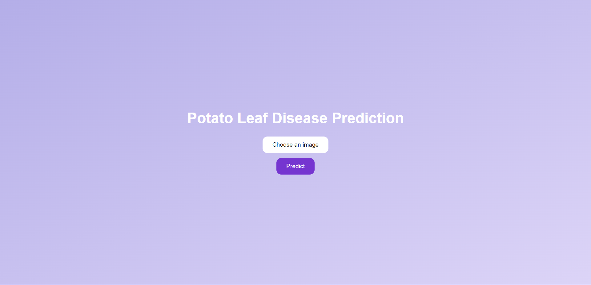
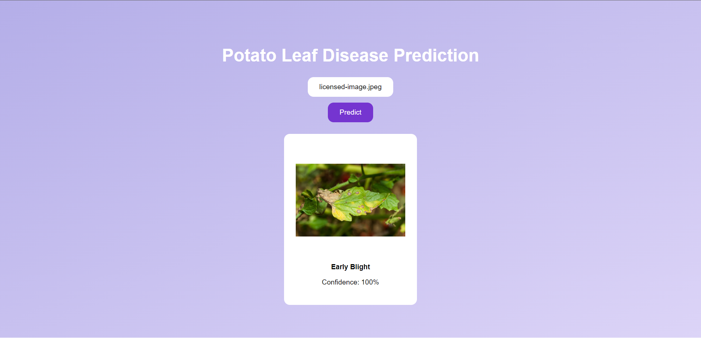

# Potato Disease Classification

## Setup for Python:

1. Install Python ([Setup instructions](https://wiki.python.org/moin/BeginnersGuide))

2. Install Python packages

```
pip3 install -r api/requirements.txt
```

## Data Collection:

1. Download the data from [kaggle](https://www.kaggle.com/arjuntejaswi/plant-village).
2. Only keep folders related to Potatoes.
3. Run Jupyter Notebook in Browser.

```bash
jupyter notebook
```

4. Open `training.ipynb` in Jupyter Notebook.
5. In cell #2, update the path to dataset.
6. Run all the Cells one by one.
7. Copy the model generated and save it with the version number in the `models` folder.

## Running the API

### Using FastAPI

1. Get inside `api` folder

```bash
cd api
```

2. Run the FastAPI Server by running the `main.py` or `mainNew.py`.

```bash
INFO:     Started server process [18792]
INFO:     Waiting for application startup.
INFO:     Application startup complete.
INFO:     Uvicorn running on http://localhost:8000 (Press CTRL+C to quit)
```

3. Your API is now running at `http://localhost:8000`

## Running the Frontend

1. Go to the root folder and open `home.html`.
2. Change the `await fetch` url to the API url you are now running.

## Deploying the TF Model (.h5) on GCP

1. Create a [GCP account](https://console.cloud.google.com/freetrial/signup/tos?_ga=2.25841725.1677013893.1627213171-706917375.1627193643&_gac=1.124122488.1627227734.Cj0KCQjwl_SHBhCQARIsAFIFRVVUZFV7wUg-DVxSlsnlIwSGWxib-owC-s9k6rjWVaF4y7kp1aUv5eQaAj2kEALw_wcB).
2. Create a [Project on GCP](https://cloud.google.com/appengine/docs/standard/nodejs/building-app/creating-project) (Keep note of the project id).
3. Create a [GCP bucket](https://console.cloud.google.com/storage/browser/).
4. Upload the tf .h5 model generate in the bucket in the path `models/potato-model.h5`.
5. Install Google Cloud SDK ([Setup instructions](https://cloud.google.com/sdk/docs/quickstarts)).
6. Authenticate with Google Cloud SDK.
7. Search for [Cloud Function](https://console.cloud.google.com/functions/)
8. Click on `Create Function`.
9. Use 512 MB or more Memory and add copy paste the requirements from `/gcp/requirement.txt` to the function `requirements.txt`.
10. Copy paste the code from `/gcp/main.py` to the code in function rename the entry point as `predict` and deploy.

Change the location of the model in gcp api code to you cloud storage location.
Your model is now deployed.
Use Postman to test the GCF using the [Trigger URL](https://cloud.google.com/functions/docs/calling/http).

## Running the Flutter APP

1. Download and install [Android Studio](https://developer.android.com/studio?gclid=CjwKCAjw67ajBhAVEiwA2g_jECMVLm9Ct5jxS3MG4WQGaBgvaL2JXQnJ35ZHibpumjBD8DKyflWD-BoC0SMQAvD_BwE&gclsrc=aw.ds)
2. Download and install [Flutter](https://docs.flutter.dev/get-started/install).
3. Run the emulator from AVD Manager in android studio.
4. Download and install Dart extension in VSCode.
5. Run `/mobileApp/go_potato/lib/main.dart` in debug mode.
6. Enjoy !!

# Results

## Potato Disease Detection Website:




